# Will a Customer Accept the Coupon?

### Overview 
The goal of this project is to use visualizations and probability distributions to distinguish between customers who accepted a driving coupon versus those that did not.

Data comes from the UCI Machine Learning repository and was collected via a survey on Amazon Mechanical Turk.The survey describes different driving scenarios including the destination, current time, weather, passenger, etc., and then ask the person whether he will accept the coupon if he is the driver. Answers that the user will drive there 'right away' or 'later before the coupon expires' are labeled as 'Y = 1' and answers 'no, I do not want the coupon' are labeled as 'Y = 0'. There are five different types of coupons -- less expensive restaurants (under $20), coffee houses, carry out & take away, bar, and more expensive restaurants ($20 - $50).

Following are the observations from Data Analysis.

1. Overall 56.8% of total observations choose to accept the coupon

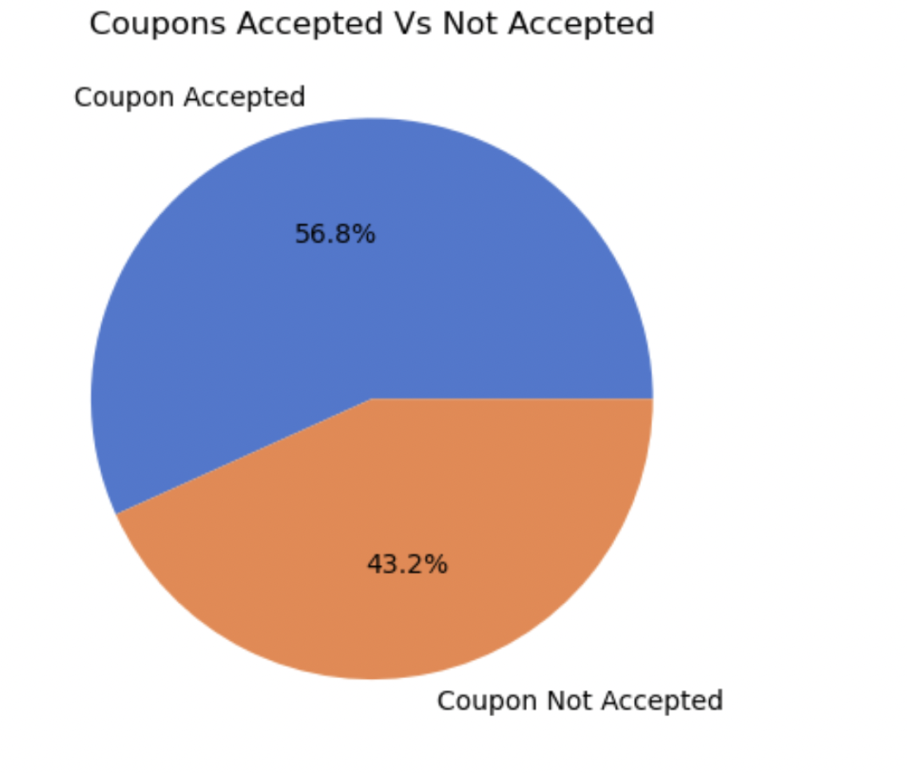

2. Coupon Accetpance by Coupon types - Coffee House ans Restaurants have better coupon acceptance 

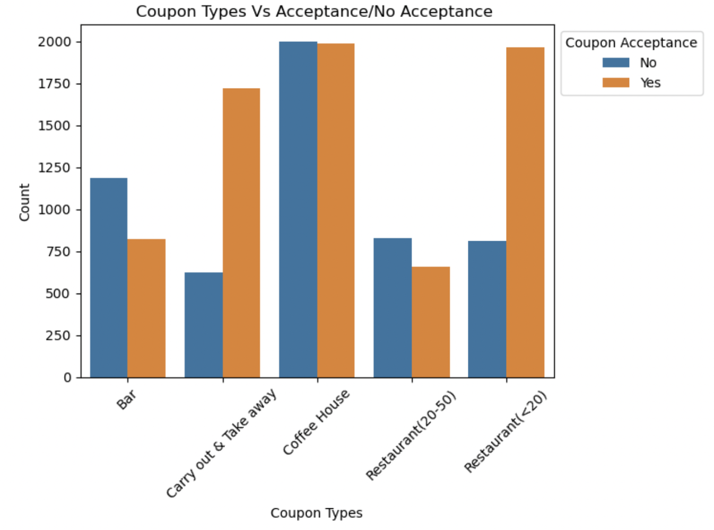

3. Types of Coupons Accetpance at Different Tempratures 

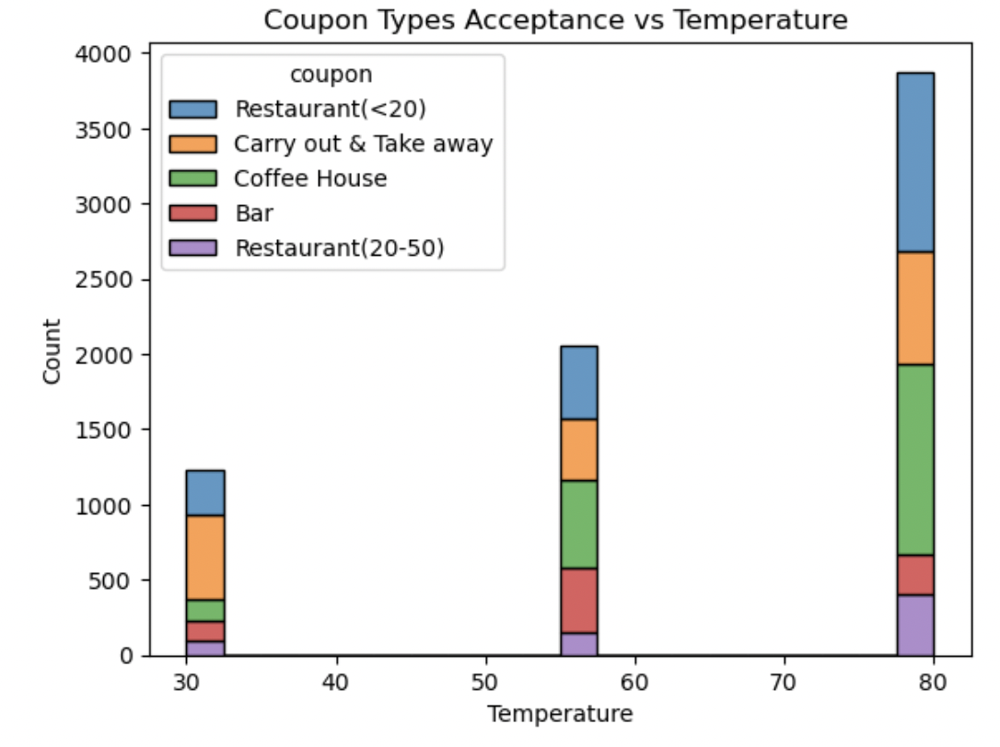

4. Coupons Accetpance with Marital Status

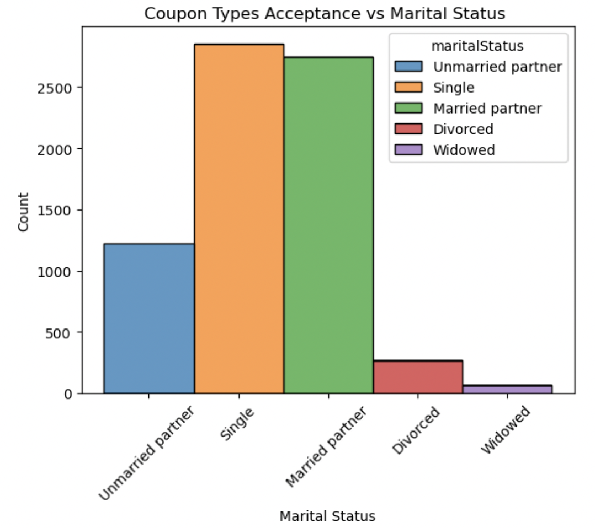

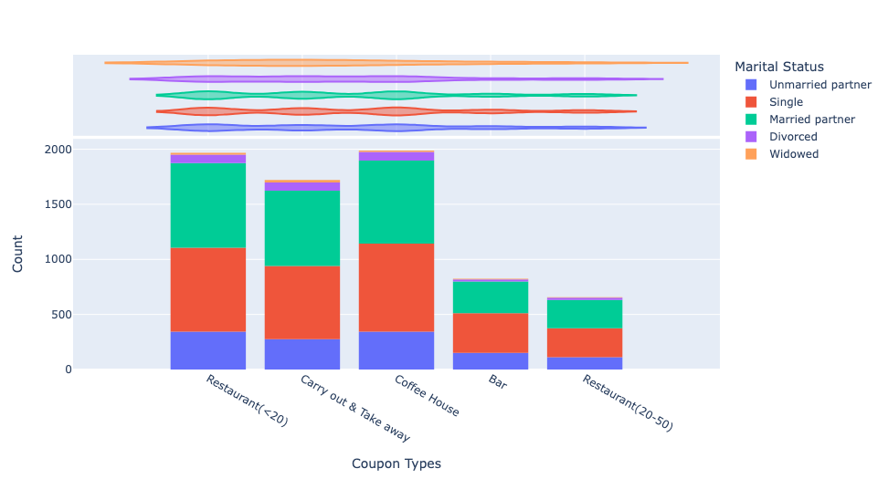

5. Total Bar Coupons Acceptance Rate

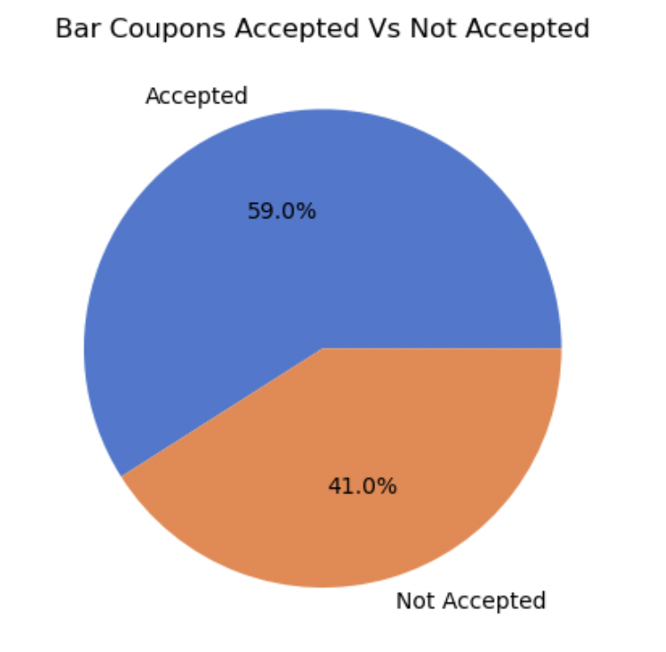

6. Bar Coupons Accepted Less than 3 vs Greater than 3

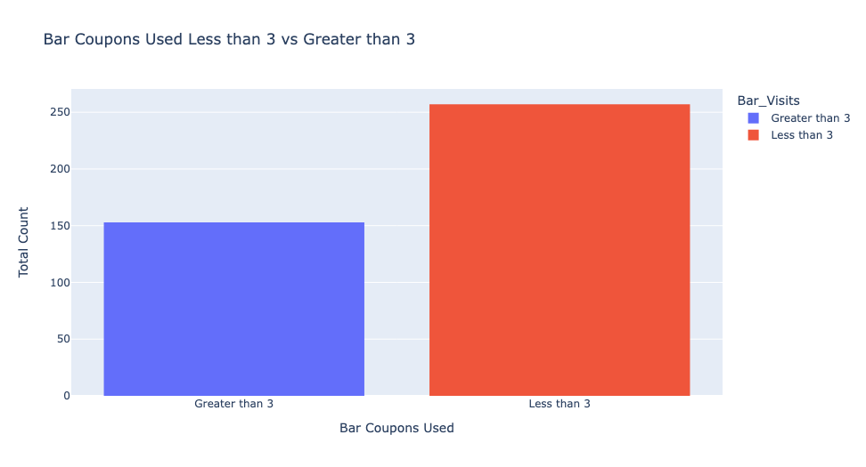

7. Acceptance rate for Drivers who go to Bar with age greater than 25

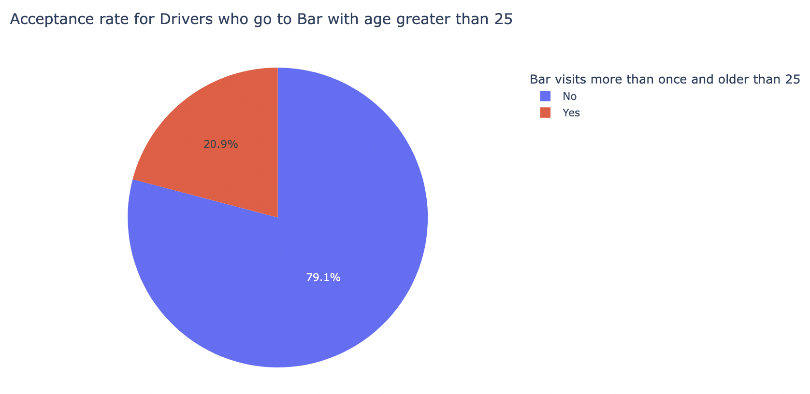

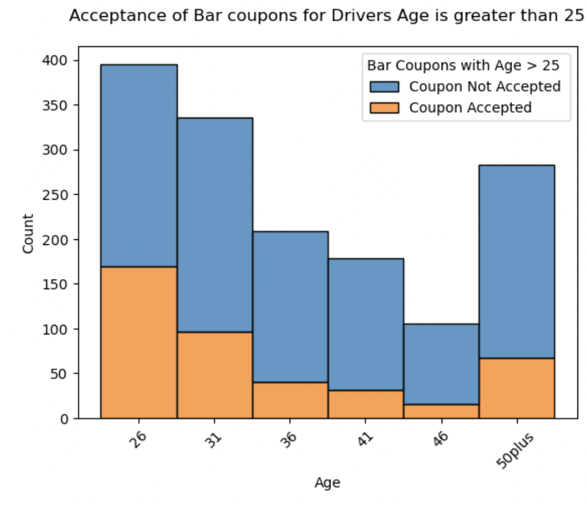

8. Drivers who go to bars more than once a month and had passengers that were not a kid and had occupations other than farming, fishing, or forestry

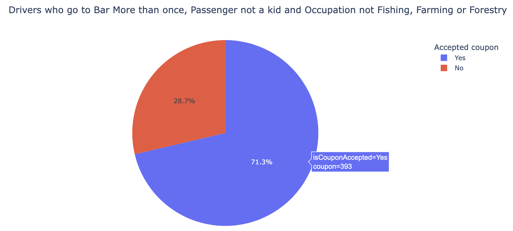

9. Compare the acceptance rates between those drivers who:
- go to bars more than once a month, had passengers that were not a kid, and were not widowed OR
- go to bars more than once a month and are under the age of 30 OR
- go to cheap restaurants more than 4 times a month and income is less than 50K.

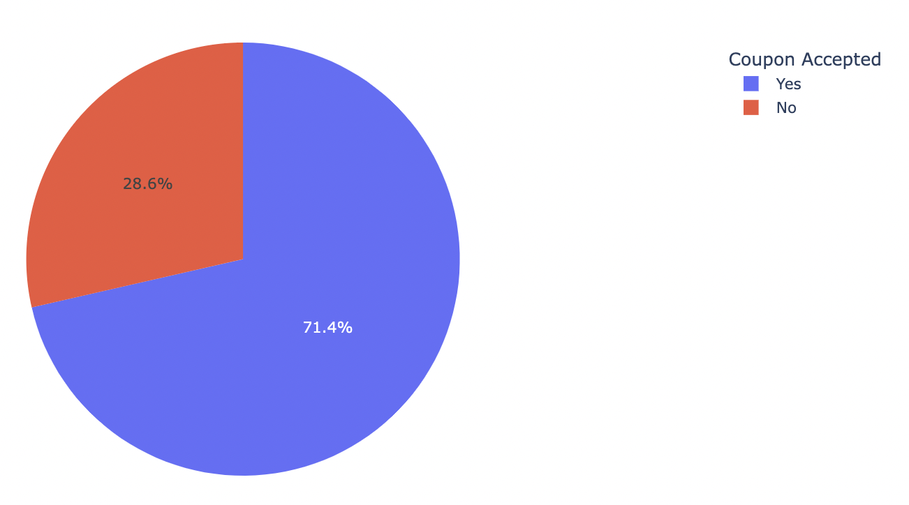

Following are few observations from the data analysis for drivers who used Carry out & Take away coupons : 

1. 74.4% of the drivers accepted "Carry out & Take away" coupons
2. Majority of Carry out & Take away Coupons were accepted during Sunny Day.
3. Less Carry out & Take away coupons on Rainy day than any other weather(Sunny or Snowy)
4. 91% of the driveres used "Carry out & Take away" coupons in Reverse direction
5. Acceptance Rate of Customers/Drivers who used  Carry Out & take away coupons 3 or more times is 35.03%
6. Acceptance Rate of Customers/Drivers who used  Carry Out & take away coupons less than 3 times is 27.39%

Similar analysis can be done on other Coupons like Coffee House, Restaurant. 